<picture>
  <!-- Shows dark.svg when the user's GitHub theme is dark -->
  <source media="(prefers-color-scheme: dark)" srcset="./assets/dark.svg">
  <!-- Shows light.svg when the user's GitHub theme is light -->
  <source media="(prefers-color-scheme: light)" srcset="./assets/light.svg">
  <!-- Fallback image -->
  
</picture>

  

  

  

